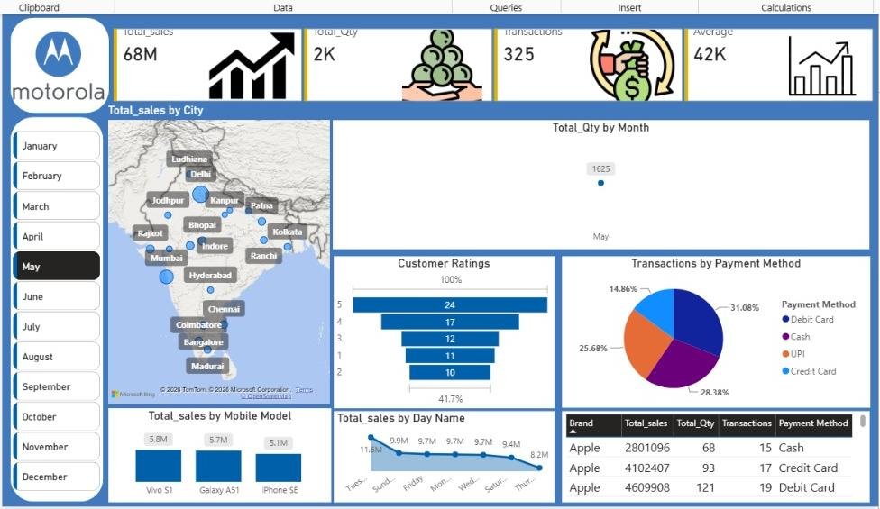

# 📱 Mobile Sales Analytics Dashboard | Power BI

## 📌 Project Overview

The **Mobile Sales Analytics Dashboard** is an interactive business intelligence project developed using Microsoft Power BI. It provides an overview of mobile sales performance through key performance indicators (KPIs), monthly trends, and interactive filters.

The dashboard helps users explore sales data, monitor performance, and understand changes in key business metrics.

## 🎯 Project Objectives

- Monitor important mobile sales KPIs.
- Analyze monthly sales and quantity trends.
- Track transactions and units sold.
- Explore performance using interactive month filters.
- Support data-driven business decisions through visual reporting.

## 🛠️ Tools & Technologies

- **Microsoft Power BI** — Dashboard development and visualization
- **Data Analysis** — KPI monitoring and trend analysis
- **Interactive Filtering** — Month-based data exploration

## 📊 Key Performance Indicators

- Total Sales
- Total Quantity
- Total Transactions
- Units Sold

*Note: KPI values update dynamically according to the selected month and available filters.*

## 📈 Dashboard Features

- Interactive KPI cards for sales performance monitoring
- Monthly quantity trend line chart
- Month slicer for interactive analysis
- Visual representation of key sales metrics
- Easy-to-understand dashboard layout

## 🖼️ Dashboard Preview

## 💼 Business Value

This dashboard provides a convenient way to monitor mobile sales performance, explore monthly trends, and review key business indicators. It demonstrates the use of Power BI to present business data in an interactive and accessible format.

## 📂 Project Files

- `Mobile-Sales-Dashboard.pbix` — Power BI report file
- `Mobile-Sales-Dashboard.jpeg` — Dashboard preview image

## 👩‍💻 Author

**Priya Kumari**

Aspiring Data Analyst | Power BI | SQL | Python | Excel

GitHub: [Priya90884](https://github.com/Priya90884)

LinkedIn: [Priya Kumari](https://linkedin.com/in/priya-kumari-35227729b)
